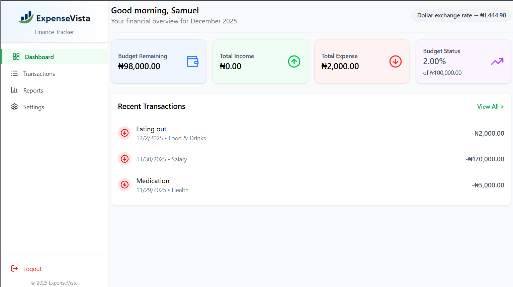
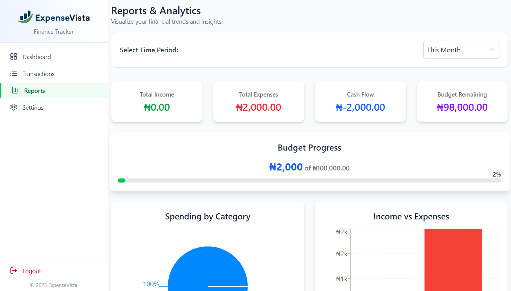
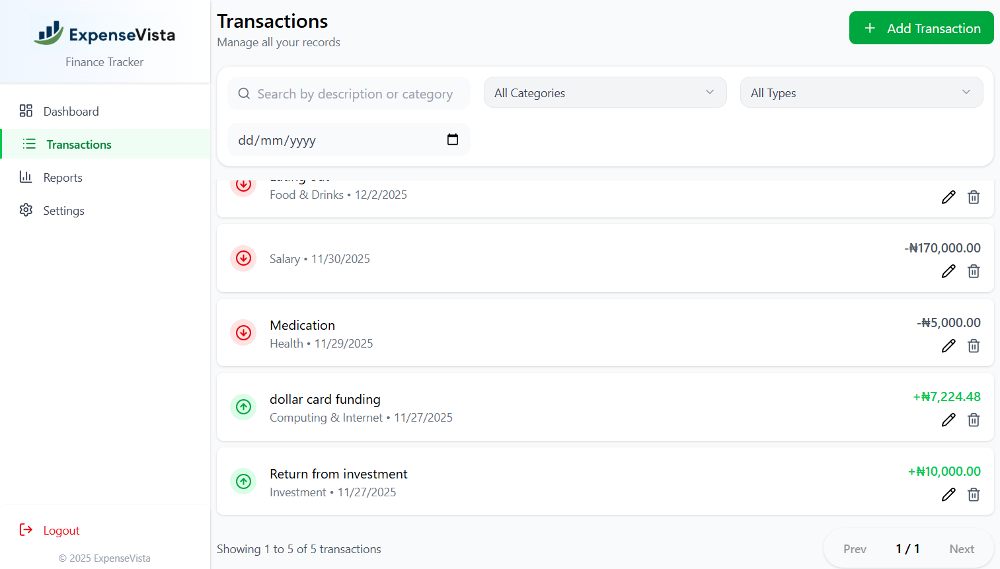
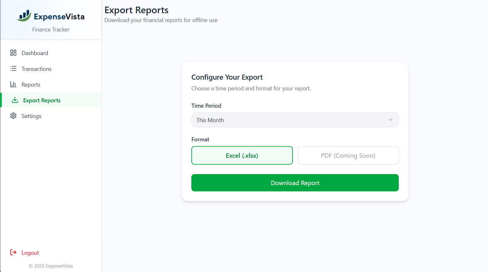

# 🚀 ExpenseVista Frontend

A modern, responsive Personal Finance Tracking Platform built with **React**, **TypeScript**, and **Tailwind CSS**. This is the client-side application for the ExpenseVista full-stack project.

[](https://expensevista.samuelcmbah.com.ng/)
[](https://github.com/samuelcmbah/ExpenseVista.API.git)
[](LICENSE)

---

## 📸 Screenshots

| **Dashboard** | **Analytics** |
| :---: | :---: |
|  |  |
| **Transactions** | **Report Export** |
|  |  |

---

## 📘 Overview

This repository contains the client-side application for ExpenseVista. It provides a rich user interface for expense tracking, budget management, and financial analysis. The application is built as a Single-Page Application (SPA) and communicates with the secure [ExpenseVista API](https://github.com/samuelcmbah/expensevista-api) for all data operations.

**Live Demo:** [https://expensevista-frontend.vercel.app/](https://expensevista.samuelcmbah.com.ng/)

---

## 🛠️ Tech Stack

*   **Core:** [React](https://react.dev/) + [TypeScript](https://www.typescriptlang.org/)
*   **Build Tool:** [Vite](https://vitejs.dev/)
*   **Routing:** [React Router DOM](https://reactrouter.com/)
*   **State Management:**
    *   **Component State:** Core React Hooks (`useState`)
    *   **Form State:** [React Hook Form](https://react-hook-form.com/) with [Zod](https://zod.dev/) for validation
*   **HTTP Client:** [Axios](https://axios-http.com/) (with custom interceptors for auth)
*   **Styling:** [Tailwind CSS](https://tailwindcss.com/) + [ShadCN UI](https://ui.shadcn.com/)
*   **Visualization:** [Recharts](https://recharts.org/)
*   **Icons:** [Lucide React](https://lucide.dev/icons/)
*   **Notifications:** [React Hot Toast](https://react-hot-toast.com/)

---

## ✨ Features

*   **Interactive Dashboard:** View monthly spending, recent transactions, and quick stats.
*   **Data Visualization:** Beautiful bar and pie charts to analyze income vs. expenses.
*   **Transaction Management:** Intuitive forms to add, edit, and delete transactions.
*   **Smart Filtering:** Filter financial data by date, category, or transaction type.
*   **Responsive Design:** Fully optimized for desktop, tablet, and mobile devices.
*   **Secure Authentication:**
    *   Full support for email/password registration and login.
    *   **Seamless "Sign in with Google"** integration using OAuth 2.0.
    *   Automatic and silent token refresh for an uninterrupted user session.

### ✨ Feature Spotlight: Full-Stack Report Export

A feature allowing users to download their financial analytics as a multi-sheet Excel report.

*   **UI:** Built with a clean, card-based interface using **ShadCN UI** and **Tailwind CSS** for report configuration.
*   **Feedback:** Provides asynchronous user feedback with a loading button and **React Hot Toast** notifications.
*   **Full-Stack Flow:**
    1.  React client requests the file from the API using **Axios** with `responseType: 'blob'`.
    2.  The **.NET API** generates the `.xlsx` file in-memory using the **ClosedXML** library.
    3.  The frontend receives the binary `blob` and uses `window.URL.createObjectURL()` to create a temporary link, triggering a secure, client-side download.
    
---

## 🔐 Authentication Flow

The frontend implements a robust authentication system designed to work seamlessly with the secure backend. To provide a secure and persistent user session, this application implements a JWT Access + Refresh Token strategy.

The process is managed by a custom Axios instance and React Context:

*   **Auth Context:** A global `AuthContext` provides the authentication state (`user`, `isAuthenticated`) to the entire application, enabling components to reactively render based on the user's status.
*   **Token Management:**
    *   The JWT **Access Token** is stored securely in-memory and attached to all private API requests via an Axios interceptor.
    *   The **Refresh Token** is handled automatically via the `HttpOnly` cookie set by the backend.
*   **Google Login (`/auth/google/callback`):**
    *   A dedicated callback component handles the redirect from Google.
    *   It extracts the `authorization_code` from the URL and sends it to the backend's `/api/auth/google-login` endpoint.
    *   Upon a successful response, it uses the `AuthContext`'s `login` function to create the user session, providing a unified login experience.
*   **Automatic Refresh:** An Axios response interceptor automatically catches `401 Unauthorized` errors. It then silently calls the `/api/auth/refresh` endpoint to get a new access token and retries the original failed request without interrupting the user.

---

## ⚙️ Installation & Setup

### Prerequisites
*   [Node.js](https://nodejs.org/) (v18 or later)
*   NPM or Yarn
*   *   A running instance of the [ExpenseVista API](https://github.com/samuelcmbah/expensevista-api).


### Steps

1.  **Clone the repository:**
    ```bash
    git clone https://github.com/samuelcmbah/expensevista.git
    cd expensevista
    ```

2.  **Install Dependencies:**
    ```bash
    npm install
    ```

3.  **Configure Environment Variables:**
    Create a `.env.local` file in the root directory by copying the example file:
    ```bash
    cp .env.example .env.local
    ```
Copy the following structure and replace the placeholder values:
    
    ```env
      # The base URL for your running backend API
      VITE_API_URL="https://localhost:7000/api"
      
      **For the live backend:**
      VITE_API_URL=https://expensevista-api.onrender.com/api

      # Your Google Client ID (from Google Cloud Console)
      VITE_GOOGLE_CLIENT_ID="PASTE_YOUR_GOOGLE_CLIENT_ID_HERE"

      # The full redirect URI for Google OAuth (must match Google Console and backend config)
      VITE_GOOGLE_REDIRECT_URI="http://localhost:5000/auth/google/callback"](url)
    ```
   Note: The .gitignore file is configured to ignore .env.local, so your local secrets will not be committed to the repository.

4.  **Run the Development Server:**
    ```bash
    npm run dev
    The application will now be running on `http://localhost:5000`.
    ```
    

## 🚀 Deployment
The frontend is deployed on Vercel for optimal performance and continuous deployment.

## 🤝 Contributions
Contributions are welcome! Please fork the repository and submit a pull request.

## 🧑‍💻 Author
**Samuel Mbah**
- GitHub: [samuelcmbah](https://github.com/samuelcmbah)
- LinkedIn: [Samuel Mbah](https://linkedin.com/in/samuelcmbah)
